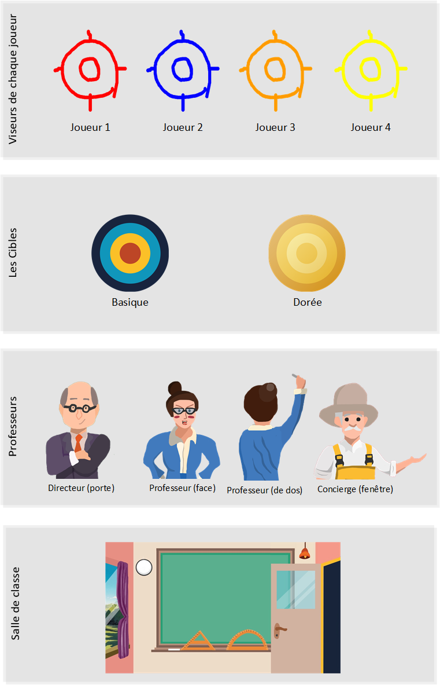

# Cancre Simulator

## Table des matières
- [Cancre Simulator](#cancre-simulator)
  - [Table des matières](#table-des-matières)
  - [Introduction](#introduction)
  - [Prérequis](#prérequis)
  - [Éléments graphiques du jeu](#éléments-graphiques-du-jeu)
  - [Installation](#installation)
  - [Jouer au jeu](#jouer-au-jeu)
  - [Membres](#membres)

## Introduction

Cancre Simulator est un jeu crée à l'occasion des portes ouvertes de la section informatique de la DIVTEC en 2020. Il se joue de une à quatre personnes. Le but est de marquer le plus de point dans le temps imparti, si un professeur vous voit tirer sur une cible, vous perdrez des points..

## Prérequis
Il est primordial de connaître les bases de programmation du language C# ainsi que de l'utilisation de Unity.

[Documentation C#](https://docs.microsoft.com/en-us/dotnet/csharp/)

[Documentation Unity](https://docs.unity3d.com/Manual/index.html)

## Éléments graphiques du jeu


## Installation

* Téléchargez [Unity](https://unity.com/fr)
* Créez-vous un compte
* Connectez-vous
* Visual Studio s'installe automatiquement avec Unity
* Clonez ce repository
* Ouvrez le depuis Unity Hub
* Installez le package "Input System"
* Définissez Visual Studio 2019 comme éditeur (Edit > Preferences > External Tools > Editor Attaching > Visual Studio 2019 (Community))
* Vous pouvez modifier le projet et build de puis l'onglet "fichiers"

Trouvez plus d'informations dans la [documentation](https://github.com/divtec-cejef/2020-JCO-CancreSimulator/blob/master/Docs/pdf/PO%202020%20CANCRE_SIMULATOR%20Rapport%20de%20travail.pdf)

## Jouer au jeu

Téléchargez "cancre_simulator_windows.zip" dans la section [Releases](https://github.com/divtec-cejef/2020-JCO-CancreSimulator/releases).

## Membres

Liste des membres :

```
Louis Bovay
Mathieu Goudron
Thomas Amstutz
```


